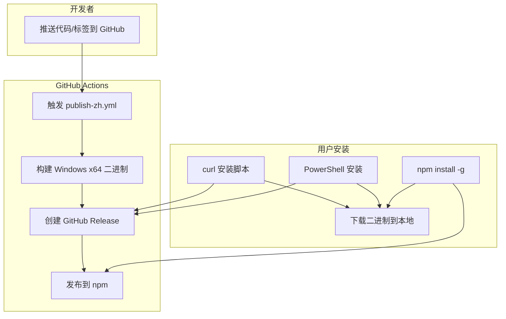

## 产品概述

为 OpenCode 汉化版实现"一条命令安装"功能，支持两种安装方式：GitHub Releases 和 npm

## 核心功能

- **GitHub Releases 安装**: `curl -fsSL https://raw.githubusercontent.com/ev71h5n1-wq/opencode-zh/main/install | bash`
- **PowerShell 安装**: `iwr https://raw.githubusercontent.com/ev71h5n1-wq/opencode-zh/main/install-zh.ps1 | iex`
- **npm 安装**: `npm i -g opencode-zh`
- **命令名称**: `opencode-zh`（明确区分汉化版）
- **支持平台**: 仅 Windows x64

## 技术栈

- 构建工具: Bun.build（项目已有）
- CI/CD: GitHub Actions（简化版）
- 包管理: npm registry
- 安装脚本: Bash + PowerShell

## 实现方案

### 方案一：GitHub Releases（优先实现）

简化官方 `publish.yml`，仅保留 Windows 构建：

1. 修改 `install` 脚本，下载地址改为汉化版仓库
2. 创建 `install-zh.ps1` PowerShell 安装脚本
3. 创建简化版 `publish-zh.yml` workflow
4. 构建 Windows x64 二进制并发布到 Releases

### 方案二：npm 发布

1. 修改 `packages/opencode/package.json`，改名 `opencode-zh`，移除 `private: true`
2. 发布包含 Windows 二进制的 npm 包
3. postinstall 脚本处理平台检测

## 架构设计



## 目录结构

```
opencode-zh/
├── install                          # [MODIFY] Bash 安装脚本，修改下载地址
├── install-zh.ps1                   # [NEW] Windows PowerShell 安装脚本
├── .github/
│   └── workflows/
│       └── publish-zh.yml           # [NEW] 简化版发布 workflow（仅 Windows）
├── packages/
│   └── opencode/
│       ├── package.json             # [MODIFY] 改名 opencode-zh，移除 private
│       └── script/
│           ├── build.ts             # [MODIFY] 添加 --windows-only 支持
│           └── publish-zh.ts        # [NEW] 汉化版发布脚本
└── 项目文件/
    └── 使用说明.md                   # [MODIFY] 添加一条命令安装指南
```

## 关键实现要点

### 1. install 脚本修改

原脚本从 `https://github.com/anomalyco/opencode/releases` 下载，需改为：

- `https://github.com/ev71h5n1-wq/opencode-zh/releases`
- 简化平台检测，仅保留 Windows x64

### 2. PowerShell 安装脚本 (install-zh.ps1)

Windows 原生支持，无需 Git Bash：

```
# 从 GitHub Releases 下载最新版本
$Release = Invoke-RestMethod https://api.github.com/repos/ev71h5n1-wq/opencode-zh/releases/latest
# 下载并解压到 $HOME/.opencode-zh/bin
```

### 3. GitHub Actions Workflow (publish-zh.yml)

简化版，仅保留核心功能：

- 触发条件：push tag `v*` 或手动触发
- 构建：仅 Windows x64（使用 `--single --baseline` 标志）
- 发布：GitHub Releases + npm

### 4. npm 包配置

```
{
  "name": "opencode-zh",
  "version": "1.1.65",
  "bin": { "opencode-zh": "./bin/opencode" },
  "private": false,
  "optionalDependencies": {
    "opencode-zh-windows-x64": "1.1.65"
  }
}
```

### 5. 构建优化

修改 `build.ts` 支持 Windows-only 构建：

- 添加 `--windows-only` 标志
- 仅构建 `win32-x64` 和 `win32-x64-baseline`

## Agent Extensions

### SubAgent

- **code-explorer**
- Purpose: 深度探索构建系统和发布相关代码，确认所有需要修改的文件位置、依赖关系和构建配置
- Expected outcome: 确认 install 脚本、publish.yml、build.ts、package.json 的具体修改点，确保方案可行